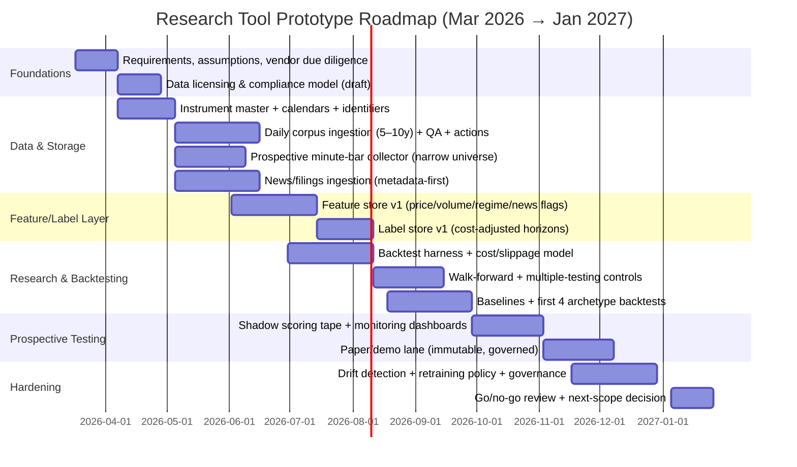

# Building a Market-Research Trading Signal Discovery Tool for Repeatable Small-Win Opportunities

## Executive summary

A “small-win” trading research tool is fundamentally a *measurement and anti-self-deception system* that converts heterogeneous market observations (prices, volumes, events, news, filings, macro, sentiment) into *time-stamped, replayable evidence*; then tests whether any observed patterns survive realistic friction, regime change, and multiple-testing risk. The primary engineering challenge is not generating ideas—it is preventing lookahead bias, survivorship bias, and backtest overfitting from producing convincing but non-repeatable results (and, therefore, losses). citeturn1search2turn1search3turn1search1turn2search1turn2search3

A rigorous design centers on three principles:

1) **Point‑in‑time truth and replayability.** You must be able to reconstruct what the system knew *at the decision time* (including publication timestamps vs first-seen timestamps, and data revisions). This calls for append-only fact capture, explicit versioning of features/labels/models, and immutable decision/evaluation logs. These principles closely align with the provided paper-trading beta docs’ emphasis on separating raw facts from derived artifacts and ensuring reproducibility/auditability. fileciteturn0file2 fileciteturn0file0

2) **A two-lane operating model: broad historical learning + narrow prospective testing.** Use a large historical corpus for discovery, but restrict “forward test / paper lane” to a small, governed universe and a limited number of promoted hypotheses. This reduces operational complexity and makes prospective performance interpretable—matching the “broad observation, narrow promotion” approach described in the beta runtime architecture. fileciteturn0file1

3) **Validation discipline that explicitly controls data-mining degrees of freedom.** Employ walk-forward evaluation, leakage-resistant CV (purging/embargo where labels overlap forward horizons), multiple-testing corrections (Reality Check / SPA), and selection-bias-aware performance statistics (Deflated Sharpe Ratio, PBO). citeturn1search2turn1search3turn1search1turn2search1turn1search4

Given no asset-class constraint (unspecified), a pragmatic prototype should start with one or two liquid asset classes (e.g., US equities + major FX) to reduce market-structure and data-licensing complexity, then expand once the research loop is demonstrably robust. This is consistent with the beta docs’ recommendation to start narrow operationally while maintaining a broader learning corpus. fileciteturn0file2

## Scope and assumptions

This report assesses **approaches and system components** for a research tool intended to discover *repeatable small-win trading opportunities* from historical and news-related trend analysis. It does **not** perform market research or recommend specific trades; it focuses on the machinery for turning data into validated hypotheses and measuring whether they remain profitable after costs. fileciteturn0file2

Unspecified assumptions (explicitly noted):

- **Asset class** is unspecified, so architectural guidance is asset-class-agnostic; however, feasible “v1” scoping typically starts with one market microstructure and one trading calendar model (e.g., listed equities regular-hours) before adding futures/crypto/OTC. fileciteturn0file1
- **Holding period** for “small-win” is unspecified; throughout, assume the target is **short-horizon edge** (minutes to a few days), where *transaction costs and slippage dominate* and data timestamp fidelity is critical. citeturn10search0turn10search17
- **Execution style** is unspecified; the beta docs referenced are paper-only and explicitly avoid broker order routing in v1, which is a sensible boundary for research integrity. fileciteturn0file2

Operational definition of “small-win” (recommended for system design): trades with **small expected value per trade** but potentially **high frequency and high hit-rate**, where profitability depends on (a) consistent signal directionality and (b) strict control of costs, adverse selection, and regime shifts. citeturn10search0turn2search1

## Data sources and ingestion architecture

### Data categories and “primary first” sourcing

A robust tool ingests six data families, each with different update frequencies, licensing constraints, and leakage risks:

**Market data (prices/volumes).**  
Foundational for labels and most technical features. Depending on horizon, you may need daily OHLCV, intraday bars (1–5 min), quotes (NBBO/Level 1), and (for very short horizons) trades and order book. The beta runtime architecture’s split—deep daily history for a broad corpus plus prospective minute-bars for a narrow live universe—is a high-leverage compromise for v1. fileciteturn0file1

**Corporate actions and calendars.**  
Essential for adjusted price series and event-driven labeling (splits, dividends, symbol changes) and for avoiding false signals from unadjusted structural breaks. fileciteturn0file0

**Fundamentals and estimates.**  
Quarterly/annual statements, daily fundamentals (market cap, shares outstanding), and (if available) point-in-time analyst estimates. The critical risk is *point-in-time correctness*; “as-reported” vs “restated” needs explicit treatment. SEC XBRL endpoints can be used as a primary source for US issuers. citeturn7search0turn7search8

**News and text.**  
At minimum: headlines + publication timestamps + stable IDs + canonical URLs; full text only when licensing permits. Event deduplication (“same story resurfacing”) and novelty detection are core to avoiding biased backtests. The beta schema’s explicit storage of publication time and “first seen” time is the right mental model for replayability. fileciteturn0file0

**Social sentiment.**  
Twitter/X, Reddit, StockTwits, etc.—often high noise, heavy licensing and privacy constraints, and high bot/manipulation risk. If used, treat as optional alternative data with strong governance. Reddit explicitly indicates commercial or beyond-limit use requires a separate agreement. citeturn6search3

**Regulatory filings and official releases.**  
These are among the cleanest “ground truth” event sources. Examples:
- US: entity["organization","U.S. Securities and Exchange Commission","federal securities regulator"] EDGAR APIs (company facts/concepts) with published guidance and fair-access rate limits (10 requests/second). citeturn7search0turn0search6  
- UK: entity["organization","Companies House","uk corporate registry"] public data API for filing history; note that operational incidents can occur (availability and data-integrity risk). citeturn7search1turn7search5turn7news40  
- UK exchange announcements: entity["organization","London Stock Exchange","uk stock exchange"] RNS Data Feed includes both pull (Announcement API) and push (WebSocket) delivery per its technical specification. citeturn7search6turn7search2

Macro and rates: entity["organization","Federal Reserve Bank of St. Louis","fred data provider"] FRED API is a standard macro source; rate limiting exists and caching is expected. citeturn7search11turn7search3

Open/global news events (for macro/topic context): GDELT is free/open with BigQuery availability. citeturn6search2turn17search6

### Vendor/API comparison table (prioritized sources first)

The table below focuses on common provider choices for a research tool; exact entitlements and redistribution rights vary materially by contract, exchange, and use case (especially for real-time and derived/redistributed outputs). citeturn0search5turn0search0turn6search3turn5search2

| Vendor / API | Best for | Coverage highlights (typical) | Access / cadence fit | Key licensing & operational notes |
|---|---|---|---|---|
| entity["company","Bloomberg","financial data vendor"] | Institutional-grade cross-asset + deep reference data | Broad multi-asset coverage; strong reference/corporate data ecosystem | Batch + low-latency feeds (enterprise), heavy governance | Terms commonly restrict competitive use/redistribution; assume strong contractual constraints and audit requirements. citeturn0search0turn0search8 |
| entity["company","LSEG Data & Analytics","refinitiv data vendor"] | Institutional market data/news/fundamentals | Enterprise data products (Workspace/DataScope ecosystem) | Batch + streaming (enterprise), strong enterprise integration | Derived data and redistribution are often licensable/controlled; treat “derived” carefully in contracts. citeturn0search5turn0search16turn0search13 |
| entity["company","FactSet","financial data vendor"] | High-quality fundamentals/prices/estimates APIs for quant workflows | Dedicated Fundamentals and Prices APIs in catalog | Strong for batch research ETL; can support near-real-time depending on product | Enterprise pricing/contracting; good metadata and identifiers can reduce entity-linking pain. citeturn3search3turn3search15turn3search7 |
| entity["company","RavenPack","news analytics vendor"] | Structured news event analytics, entity/event classification, sentiment factors | Large entity base and event taxonomy; news analytics products marketed for alpha/risk | Low-latency news analytics; best as “event feature feed” not raw news archive | Vendor-derived features can speed prototyping but increase vendor dependence; still validate economically (not just statistically). citeturn6search0turn6search12turn6search16 |
| entity["company","Nasdaq Data Link","market data platform"] | Research-friendly datasets (EOD, fundamentals, exchange datasets) | Time-series + table dataset formats; includes Sharadar datasets like SEP/SF1 | Batch ETL; strong for building an initial daily corpus | Dataset entitlements vary by database; good fit for historical corpus construction. citeturn3search1turn3search9turn3search25 |
| entity["company","Polygon.io","market data api provider"] | Developer-first market data (stocks/options/forex/crypto) | REST/WebSocket + flat files; includes minute aggregates; options data typically involves OPRA terms | Streaming + intraday research; useful for prospective minute-bar capture | Market-data terms often flow down exchange/provider agreements (e.g., OPRA / Nasdaq/UTP) and may impose usage reporting and redistribution constraints. citeturn5search4turn5search2turn5search23 |
| entity["company","Tiingo","market data api provider"] | Affordable prices + fundamentals + news for research | Products include fundamentals and an institutional news API; docs specify coverage claims | Batch-first; can support near-real-time depending on plan | Clear documentation/pricing pages can reduce discovery cost; still validate timestamp fidelity for news. citeturn4search5turn4search1turn4search14 |
| entity["company","Intrinio","financial data api provider"] | Modular APIs for fundamentals/options/prices/news (varied packages) | Documented endpoints for option prices realtime/batch and fundamentals via SDKs | Batch + some real-time modules; good for incremental add-ons | Pay attention to exchange fee pass-through and “display/non-display” entitlements for real-time. citeturn4search2turn4search9turn4search15 |

### Data frequency, storage, and ETL design

A practical system needs *different pipelines by cadence*:

**Daily batch layer (historical corpus).**  
- Ingest: daily OHLCV, corporate actions, benchmark/sector proxies, FX conversion series.  
- Storage: append-only raw tables plus revision markers to preserve auditability. The beta schema explicitly models revisions (e.g., revision_number/is_latest_revision), which is key when vendors correct historical bars. fileciteturn0file0  
- Partitioning: by instrument × date; store as Parquet (data lake) for scale or SQLite/Postgres for simpler v1; keep a separate “portfolio truth” DB from research DB to avoid write amplification, exactly as recommended in the beta docs. fileciteturn0file0

**Intraday/stream layer (prospective observation).**  
- Ingest: minute bars (or faster) for a narrow “active universe.”  
- Operational guardrail: price/FX freshness takes precedence over optional enrichment, consistent with the beta runtime’s recommendation to avoid turning paid news into a hot-path dependency. fileciteturn0file1

**News/event layer (prospective first).**  
- Store article *metadata first* (source, canonical URL, published timestamp, first-seen timestamp, content hash).  
- Perform deterministic entity linking where possible (ticker tags, stable identifiers) and probabilistic linking where necessary; persist linkage evidence and confidence. This matches the schema’s separation of articles, text snapshots, story clusters, and instrument links. fileciteturn0file0  
- Deduplicate and “novelty tag” to avoid counting the same event repeatedly; this is especially important because news effects are often strongest on first report. citeturn13search0turn13search1

**Regulatory filings layer (official timestamp).**  
- Use official APIs with caching and rate limiting (SEC fair access). citeturn0search6turn7search0  
- Treat filings as event sources: parse structured XBRL where feasible; store raw filing references and extracted facts; maintain point-in-time snapshots to avoid lookahead. citeturn7search0turn7search8

## Feature engineering for trend and event signals

The goal of feature engineering in this tool is not to “add indicators,” but to build **economically interpretable state variables** that can be audited, versioned, and tested across regimes and cost models. The beta docs’ insistence that features be stored (not left embedded in model code) is aligned with best practice for reproducible research pipelines. fileciteturn0file2

### Price/volume and cross-sectional context features

Core families (illustrative, not exhaustive):

- **Returns and reversals:** multi-horizon returns (1–5 bars, 1–20 days), intraday reversal markers, gap features. Short-horizon reversal effects have a long academic history and need explicit spread/cost modeling to remain credible. citeturn14search1turn14search9  
- **Momentum and relative strength:** cross-sectional momentum (winners/losers), industry/sector momentum decomposition; industry momentum is documented as a strong component of stock momentum. citeturn14search0turn14search3turn14search7  
- **Volatility state:** realized volatility, range expansion, volatility-of-volatility, and “volatility regime” indicators.  
- **Liquidity/abnormal volume:** rolling volume z-scores, turnover, dollar volume, spread proxies; small-win systems are structurally sensitive to liquidity and adverse selection. citeturn10search17turn10search0  
- **Market/sector neutralization:** features and labels that are market- and sector-relative reduce false positives driven by broad beta moves; the beta schema already anticipates benchmark mappings and sector reference series for this purpose. fileciteturn0file0

### Event flags and time alignment

For scheduled and semi-scheduled events, create explicit event-time features:

- **Earnings proximity & windows:** days-to-earnings, post-earnings drift windows, intraday “announcement time bucket” flags (pre-market/in-session/after-hours). Event-study methodology provides a principled framework for isolating abnormal returns around events. citeturn11search2turn14search14  
- **Macro calendar:** central bank decisions, CPI, jobs reports; use a reference calendar and align to trading sessions. citeturn7search11turn7search6  
- **Corporate action proximity:** split/dividend effective dates and known symbol change windows, to avoid spurious signals from mechanical price changes. fileciteturn0file0

### News and NLP-derived features

Empirically, news content and coverage can correlate with near-term market activity; however, causality and timing are tricky, so timestamp discipline and deduplication are non-negotiable. citeturn13search0turn13search1turn11search2

Recommended feature families:

- **Sentiment scoring:**  
  - Lexicon-based scoring calibrated to finance text (e.g., Loughran–McDonald). The Loughran–McDonald dictionary was developed because general sentiment word lists misclassify financial language, especially in filings. citeturn0search3turn0search15  
  - Transformer-based models such as FinBERT for financial sentiment classification. citeturn13search2  
- **Topic modeling and thematic regimes:** latent topics (LDA) or embedding-based clustering to detect shifting narratives (e.g., “rate cuts,” “AI capex,” “bank stress”). citeturn13search3turn13search19  
- **Entity extraction and mapping:** convert text into structured entity/event triples (Company A + event type + polarity), then join into the feature store via instrument aliases. Vendors like RavenPack market large entity databases and event taxonomies; whether you build or buy, you still need systematic validation. citeturn6search0turn6search12  
- **Novelty + saturation:** reduce double-counting by clustering near-duplicate stories, and explicitly model “first report vs follow-up,” consistent with the beta schema’s story clustering and novelty status design. fileciteturn0file0

### Alternative data features (optional, governance-heavy)

Open and semi-open sources can add context but introduce licensing and stability risk:

- **Wikipedia pageviews:** official Wikimedia Analytics API provides pageview metrics; use as attention proxies, not sentiment. citeturn17search3turn17search5  
- **Google Trends:** Google announced an alpha Trends API; availability/quotas can constrain production use, and unofficial scraping approaches are fragile. citeturn17search7turn17search24  
- **GDELT:** open global news/event graph can supply macro “theme pressure” features. citeturn6search2turn6search10

## Signal discovery and validation methods

This section is the core of “assessing the strategy for a system that will”—because the system’s research credibility is determined by its evaluation design far more than its model sophistication. citeturn1search2turn1search3turn1search1turn2search1

### Statistical discovery techniques suited to “small-win” research

Prioritize methods with clear null hypotheses, robust standard errors, and interpretable failure modes:

- **Autocorrelation/mean reversion tests:** short-horizon reversals and contrarian effects are documented; in practice, confirm they survive bid–ask and slippage assumptions. citeturn14search1turn14search9  
- **Unit-root / stationarity tests:** use ADF/related tests to avoid fitting trending non-stationary series as if stationary. citeturn16search9  
- **Cointegration/spread trading primitives:** Engle–Granger methodology provides a canonical starting point for pair relationships and error-correction logic, but still demands cost-aware backtests and regime stability checks. citeturn16search4turn16search0  
- **Event studies:** use event-time alignment and abnormal return computation to evaluate news/filings/earnings effects. citeturn11search2turn11search14  
- **Regime segmentation:** Markov-switching/regime models are a classical approach for capturing discrete shifts; regimes are crucial because many “small edges” are regime-conditional. citeturn11search23turn11search3

### Machine learning methods and where they fit

The ML objective should be modest: learn conditional expectancy or rank opportunities, not “predict the market” in the abstract.

Useful model families include:

- **Supervised tabular models:** regularized regression, tree ensembles (e.g., gradient boosting) over engineered features; often strong baselines for cross-sectional ranking when paired with careful CV.  
- **Sequence models:** if using intraday bars, evaluate temporal models only after you can demonstrate leakage-free training and realistic fills.  
- **Text models:** FinBERT-like classifiers for sentiment/event polarity; topic embeddings for thematic features; always keep publication time and first-seen time separable to avoid leakage. citeturn13search2turn13search0  
- **Unsupervised clustering:** volatility/liquidity regimes, topic regimes, and “market state” clustering; pair with regime-aware backtests and stability checks. citeturn11search23turn10search17

### Backtesting, walk-forward evaluation, and overfitting controls

A research tool aimed at profit must be *adversarial toward its own results*. Key controls:

- **Walk-forward (rolling) evaluation:** train on past, test on future; repeat across multiple windows; include at least one full holdout period never touched until late-stage “promotion review.” This is consistent with the beta architecture’s distinction between historical learning and prospective promotion. fileciteturn0file1  
- **Leakage-resistant cross-validation:** when labels depend on future horizons, avoid overlapping train/test information; López de Prado’s work emphasizes purging and embargo to mitigate leakage. citeturn1search4turn2search15  
- **Multiple testing / data snooping corrections:**  
  - White’s Reality Check directly targets “best model among many tried.” citeturn1search2  
  - Hansen’s SPA test improves power and addresses weaknesses of RC for some settings. citeturn1search3  
- **Selection-bias-aware performance statistics:**  
  - Deflated Sharpe Ratio adjusts Sharpe claims for multiple trials and non-normal returns. citeturn2search1  
  - Probability of Backtest Overfitting (PBO) addresses the structural chance of selecting an overfit “winner.” citeturn1search1  
- **Textbook KPI inflation controls:** even “classic” metrics like Sharpe are estimation-error sensitive; Sharpe’s own note links the historical Sharpe ratio to a t-stat-style significance framing. citeturn12search0

### Backtesting framework comparison table

Below are four commonly used frameworks with different tradeoffs (speed vs realism vs ecosystem). Build-vs-buy often matters less than *data correctness + evaluation discipline*, but framework choice affects time-to-prototype and realism. citeturn8search7turn8search5turn8search3turn9search5

| Framework | Strengths | Limits / risks | Best fit in a research tool |
|---|---|---|---|
| LEAN (entity["organization","QuantConnect","algorithmic trading platform"]) | Open-source engine supporting research/backtesting/live; supports Python/C#; strong ecosystem | Heavier operational complexity; “platform gravity” if you adopt full stack | When you want a unified path from research to paper/live simulation with realistic brokerage/data adapters. citeturn8search7turn8search15 |
| Backtrader | Feature-rich Python backtesting/trading framework; event-driven; flexible indicators/analyzers | Community-maintained; realism depends on your slippage/commission models | When you want readable strategy code + event-driven simulation on local infrastructure. citeturn8search5turn8search8 |
| VectorBT | Very fast vectorized research/backtesting on NumPy/Pandas, Numba-accelerated | Less natural for market-microstructure realism; careful with fill modeling and event ordering | When you need massive parameter sweeps and idea screening, then “graduate” survivors to a more realistic simulator. citeturn8search3turn8search21 |
| Backtesting.py | Lightweight, approachable, good for rapid iteration; built-in spread/commission knobs | Not designed for complex multi-asset portfolio mechanics at scale | When you want fast prototyping of single-asset or simple strategies with basic friction simulation. citeturn9search5turn9search4 |

Note: Some historically popular libraries (e.g., original Quantopian Zipline) are explicitly not maintained upstream, which is a governance risk if chosen for a long-lived system. citeturn8search9

## Risk management and execution modeling

Small-win strategies are disproportionately sensitive to *implementation shortfall* (spread, slippage, market impact, latency, and fill assumptions). Therefore the research tool must treat execution and risk as first-class components—not afterthoughts. citeturn10search0turn10search17turn10search15

### Position sizing and portfolio constraints

For a research tool (especially paper-only), focus on **controlled, explainable sizing**:

- Volatility targeting and max-position constraints to limit regime blow-ups.  
- Exposure caps by sector/theme (to avoid “one latent bet”).  
- Stop/target/horizon logic should be evaluated as part of the strategy archetype, not tuned post hoc, to limit degrees of freedom (overfit risk). citeturn2search3turn1search1

### Slippage, transaction costs, and market impact

You need a cost model that scales with liquidity and urgency. Almgren–Chriss provides a canonical framework modeling both temporary and permanent market impact and constructing an efficient frontier over execution schedules. citeturn10search0turn10search12

For microstructure realism, Hasbrouck’s microstructure framework emphasizes the institutional and econometric structure of trading and costs—useful background for deciding when minute bars are sufficient vs when you need quotes/order book. citeturn10search17turn10search21

Minimum viable cost modeling (for v1 research credibility):
- Commissions/fees (venue/broker schedules where applicable)  
- Half-spread + slippage as a function of volatility and volume participation  
- Market impact approximation that increases with trade size relative to daily/interval volume citeturn10search0

### Evaluation metrics and KPIs

A research tool should report *both* return metrics *and* trading-efficiency/robustness metrics. The table below includes the KPIs you requested plus practical complements.

| KPI | What it measures | Why it matters for small-win research | Common pitfalls |
|---|---|---|---|
| Sharpe ratio | Excess return per unit of return volatility; closely related to a significance-style framing in Sharpe’s discussion | Good first-pass comparability across strategies/horizons | Inflated by overfitting, non-normal returns, autocorrelation, short samples; does not capture drawdown path. citeturn12search0turn2search1 |
| Sortino ratio | Reward per unit of downside deviation (downside risk focus) | More aligned with “avoid big losses while harvesting small wins” | Definitions vary (target return, downside measure); can be gamed by fat-tail behavior. citeturn11search13turn12search16 |
| Hit rate | % winning trades | High hit rate often characterizes “small-win” designs | High hit rate can coexist with negative expectancy if losses are larger than wins; sensitive to cost model. |
| Max drawdown | Peak-to-trough loss | Critical for capital survivability and user trust | Path-dependent; can be underestimated in short backtests or regime-limited samples. |
| Expectancy | Average profit per trade: (win%×avg win) − (loss%×avg loss), net of costs | Directly answers “does each bet pay after friction?” | Must be computed with realistic costs and fill rules; unstable if sample is small. |
| Turnover | Trading volume / portfolio value over period | Proxy for cost sensitivity and operational burden | High turnover can erase gross edge; must be paired with estimated implementation shortfall. citeturn10search0turn10search17 |
| Profit factor (optional) | Gross profits / gross losses | Intuitive robustness check | Can be unstable with few tail losses; not risk-adjusted. |
| Exposure time (optional) | % of time capital is deployed | Helps interpret Sharpe/returns | Low exposure can look great but may not scale. |
| Deflated Sharpe Ratio (recommended) | Sharpe adjusted for selection bias and non-normality | Essential when you run many experiments and pick winners | Requires tracking the number of trials and return distribution moments. citeturn2search1turn1search1 |

## Implementation stack and compliance considerations

### Stack options with cost/complexity tradeoffs

A research tool like this typically lives in one of three architectural “bands”:

**Local-first, single-machine research + paper lane (lowest ops complexity).**  
- Languages: Python for ETL/features/models; optionally Rust/Go for high-throughput ingestion.  
- Storage: SQLite/Postgres for metadata and event logs; Parquet/DuckDB for large historical tensors; object store (local filesystem/S3-compatible) for model artifacts.  
- Orchestration: simple scheduler (cron) or lightweight orchestrator.  
This is consistent with the beta technical plan’s approach: separate the beta supervisor process from the web app, keep the deterministic core stable, and constrain resource usage by default. fileciteturn0file3

**Hybrid local + managed cloud data (moderate complexity).**  
- Raw data in cloud object storage; compute locally for research jobs; optionally stream prospective data to a managed time-series store.  
- Better scalability for large universes, but increases security, governance, and cost variance.

**Cloud-native research platform (highest complexity, highest scale).**  
- Streaming: Kafka/Redpanda; compute: Spark/Ray; stores: warehouse + lakehouse; feature store service.  
- Worth it only if you *actually* need tick-scale or multi-asset global scale and can enforce strong governance.

A common “best of both” approach for an unspecified budget: **local-first prototype** (fast iteration, easy audit) + deliberate migration of only proven bottlenecks to cloud. fileciteturn0file3

### Compliance, data licensing, and ethical considerations

**Market data licensing is not optional.** Contracts frequently restrict redistribution and define “derived data” in complex ways; some exchanges explicitly treat derived data creation and redistribution as licensable use cases. citeturn0search5turn0search16

Key compliance patterns:

- **Treat vendor market-data TOS as engineering requirements.** For example, Bloomberg’s terms include restrictions on using/distributing service information in ways that compete with Bloomberg or suppliers. citeturn0search0turn0search8  
- **Exchange policy compliance for real-time and derived outputs.** London Stock Exchange policy guidelines explicitly address derived data and redistribution as licensable use cases, including in AI contexts. citeturn0search5turn0search21  
- **Social data rights and privacy:** Reddit’s Data API terms indicate commercial use or beyond-limits research requires a separate agreement. citeturn6search3

**Algorithmic trading controls (even if paper-only) as design guidance.**  
If the system ever moves toward real execution (even later), regulators emphasize resilient systems, thresholds/limits, and controls to prevent erroneous orders and disorderly markets. For US context, the SEC’s Market Access Rule (15c3-5) describes required risk controls and supervisory procedures to prevent erroneous orders and enforce credit/capital thresholds. citeturn10search15

For EU/UK context, MiFID II RTS 6 summarizes systems and risk controls expectations for firms engaged in algorithmic trading, and recent guidance documents discuss supervisory expectations and risks to market integrity. citeturn15search2turn15search0turn15search1

For UK market abuse surveillance, firms must have effective arrangements to detect and report suspicious activity under UK MAR. citeturn15search3

The beta docs’ insistence on isolation (paper-only, no broker routing), evidence logging, and immutable demo-trade records is aligned with the compliance-first posture that reduces both legal risk and research self-deception. fileciteturn0file2 fileciteturn0file4

## Prototype roadmap and initial strategy archetypes

This roadmap assumes an unspecified budget but aims for a credible 6–12 month path with tight governance and measurable milestones. It mirrors the beta implementation plan’s staged operating modes (observe → shadow → demo) and the separation between research corpus and narrow live scoring lane. fileciteturn0file3 fileciteturn0file1

### Data-to-signal pipeline flowchart

```mermaid
flowchart LR
  A[Data Sources<br/>Prices/Volumes<br/>Fundamentals<br/>News/Feeds<br/>Filings<br/>Alt Data] --> B[Ingestion Connectors<br/>Batch ETL + Stream Collectors]
  B --> C[Raw Fact Store<br/>Append-only + revisions]
  C --> D[Normalization & QA<br/>Corporate actions<br/>Calendars/timezones<br/>ID mapping]
  D --> E[Feature Store<br/>Versioned features<br/>Point-in-time joins]
  E --> F[Label Store<br/>Horizon returns<br/>Cost-adjusted outcomes]
  F --> G[Research & Experiments<br/>Hypotheses registry<br/>Walk-forward/CV]
  G --> H[Backtesting Engine<br/>Costs/slippage<br/>Constraints]
  H --> I[Promotion Gate<br/>Multiple-testing controls<br/>Risk checks]
  I --> J[Prospective Lane<br/>Shadow scoring<br/>Paper/demo trades]
  J --> K[Evaluation & Reporting<br/>KPI tape<br/>Attribution<br/>Drift alerts]
  K --> G
```

### Roadmap timeline with milestones and resourcing

Resource estimates (typical, adjustable):
- 1 data/ETL engineer (or strong backend engineer)  
- 1 quant researcher/ML engineer  
- 0.5–1 product/QA/ops support (part-time), plus periodic legal review for licensing

Milestone gates (what “done” looks like):
- **Gate A (end of Foundations):** signed-off data entitlements, explicit definition of “derived data,” documented retention rules. citeturn0search16turn0search5  
- **Gate B (end of Data & Storage):** replayable daily corpus + prospective minute tape for a narrow universe; SEC/LSE filings/news ingestion with stable timestamps. citeturn7search0turn7search6  
- **Gate C (end of Research & Backtesting):** leakage-resistant evaluation, cost-adjusted labels, multiple-testing controls integrated into experiment workflow. citeturn1search2turn1search3turn2search1turn1search1  
- **Gate D (end of Prospective Testing):** shadow scoring + paper lane produces immutable evaluation artifacts; paper results are tracked separately from backtests to quantify decay. fileciteturn0file2

### Recommended “small-win” strategy archetypes to test first

These are archetypes to validate in a controlled research tool—chosen because they map cleanly to available data types (prices, events, news) and have a substantial academic backdrop. Designs below specify *how to test*, not “what to trade.”

**Mean-reversion / short-term reversal (microstructure-aware).**  
Rationale: short-horizon reversals have been documented, commonly attributed to liquidity provision and temporary price pressure. citeturn14search1turn14search9  
Backtest design:
- Universe: highly liquid equities to reduce spread noise; exclude wide-spread names.  
- Signal: extreme short-horizon return + abnormal volume / volatility expansion; optionally market/sector-neutral.  
- Entry/exit: enter on next bar open (or modeled mid) after signal; exit on fixed horizon or reversion threshold; include stop-loss for tail events.  
- Validation: walk-forward splits across multiple regimes; ensure costs are conservative (spread + slippage increases with volatility). citeturn10search0turn2search1

**News-driven momentum / attention shock.**  
Rationale: media content correlates with market activity; identifying timing and novelty is central. Tetlock documents relationships between media sentiment and market behavior; Engelberg–Parsons emphasize causal identification challenges in media impact. citeturn13search0turn13search1  
Backtest design:
- Data: news metadata with reliable publication time; novelty clustering; entity linking.  
- Signal: first-report negative/positive sentiment bucket (FinBERT or finance lexicon), plus “surprise proxy” (unusual topic or rare event class). citeturn13search2turn0search3  
- Horizon: intraday to 1–3 days; explicitly separate in-session vs after-hours announcements.  
- Validation: event-study anchors + walk-forward; strict prevention of lookahead (use first-seen time for availability). citeturn11search2

**Earnings surprise scalps / post-earnings drift variants.**  
Rationale: PEAD is a long-studied anomaly; modern work reviews drift behavior and motivates event-window testing. citeturn14search14turn11search2  
Backtest design:
- Data: earnings event calendar + actuals vs expectations if available (or proxy surprise using price/volume reaction in first minutes/hours).  
- Signal: standardized surprise (or proxy) + confirmation filter (abnormal volume, gap).  
- Entry: defined time buckets (e.g., first regular-session bar after release).  
- Exit: short horizon “scalp” version (hours–1 day) vs classic drift version (days–weeks); compare both to demonstrate where small-win is feasible net of costs. citeturn10search0turn14search14

**Sector rotation / industry momentum overlay.**  
Rationale: industry momentum is documented as a substantial component of stock momentum; sector/industry-relative features often generalize better than single-name patterns. citeturn14search3turn14search7  
Backtest design:
- Data: sector/industry mappings + sector proxies + index benchmarks (for neutralization).  
- Signal: rank industries by trailing returns and volatility-adjusted strength; allocate to top sectors and within-sector top names (or sector ETFs).  
- Frequency: weekly/monthly rebalance (lower turnover than small intraday edges).  
- Validation: walk-forward by decade/regime; explicit turnover + cost sensitivity reporting. citeturn2search1turn10search17

A practical workflow is to use a high-speed research engine (e.g., vectorized screening) to generate thousands of candidate parameterizations, then promote a small subset into an event-driven simulator with conservative execution modeling and multiple-testing-aware significance checks. citeturn8search3turn2search1turn1search2